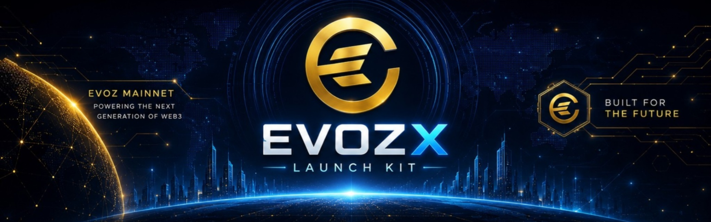

🚀 EVOZX Launch Kit

Token Launchpad for EVOZ Mainnet

  

Create ERC20 Burnable Tokens on EVOZ Mainnet in seconds.

No coding. No deployment scripts. No complexity.

---

🌐 Live Application

Launch Kit

https://evozxlabs.github.io/EVOZX-LaunchKit/

---

✨ Features

- 🔥 ERC20 Burnable Token Creation
- 📱 Mobile Wallet Support
- ⚡ One-Click Deployment
- 📊 Factory Statistics Dashboard
- 🪙 Personal Token Portfolio
- 🌍 Recent Token Explorer
- ⛓ Native EVOZ Mainnet Integration
- 📖 Open Source

---

🪙 Token Standard

Every token deployed through EVOZX Launch Kit includes:

- ERC20 Standard
- ERC20 Burnable Extension

Available functions:

transfer()
approve()
transferFrom()
burn()
burnFrom()

---

📜 Smart Contract Source

All tokens created by EVOZX Launch Kit are generated from the official source contract.

Source Code:

/contracts/EVOZXToken.sol

Reference:

https://github.com/EVOZXLabs/EVOZX-LaunchKit/tree/main/contracts

The same source code is used for every token deployment.

Only these parameters change:

- Token Name
- Token Symbol
- Total Supply
- Creator Address

---

⚡ Supported Wallets

- TokenPocket
- MetaMask
- OKX Wallet
- Bitget Wallet
- Rabby Wallet

---

⛓ Network Information

Item| Value
Network| EVOZ Mainnet
Chain ID| 805
Currency| EVOZ
RPC| https://rpc.evozscan.com
Explorer| https://evozscan.com

---

🏭 Factory Contract

0x3F810a44D29a4f0fF7880641E69EBCBc076dA220

---

🚀 How It Works

1. Connect Wallet
2. Enter Token Name
3. Enter Token Symbol
4. Enter Total Supply
5. Deploy Token
6. Receive Contract Address
7. Add Token To Wallet

---

📦 Current Release

Version| Status
v1.0.0| Stable Release

Latest Release:

https://github.com/EVOZXLabs/EVOZX-LaunchKit/releases

---

🛣 Roadmap

V1 Stable

- ERC20 Burnable Tokens
- Factory Dashboard
- Mobile Wallet Support
- Explorer Integration

V2 Planned

- Verification Package Generator
- Source Export Tools
- Enhanced Explorer Support
- Metadata Generator
- Advanced Token Analytics

---

📜 License

MIT License

---

Powered by EVOZX Labs

Building the Future of the EVOZ Ecosystem

